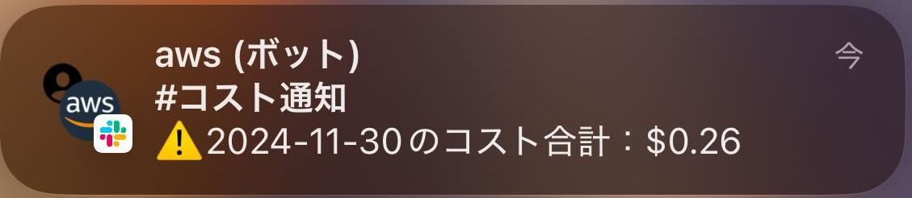

# DailyAWSCostGuard

## 概要

AWS 利用料を 1 日単位で Slack に通知します。

## 注意点

以下サービスを利用しているため、事前に利用できるようにしておく必要があります。

- 事前に AWS Chatbot と Slack の連携が必要です。
- Bedrock の以下のモデルを利用しています。
  - Claude 3.5 Sonnet

## 仕組み

EventBridge Scheduler をトリガー（毎日 JST9:00）に Step Functions をステートマシン起動します。

ステートマシンでは以下の動作です。

### 1.処理対象日を決定

CostExploler の反映は約 24 時間後になるため、前日ではなく、前々日を対象としています。

### 2.コストの取得

CostExploler の`GetCostAndUsage`API を利用し、コストを取得します。

### 3.コスト要約

Bedrock を利用し、サービス別の利用コストの要約を作成します。

### 4.Slack へ通知

1 日トータルのコストや、サービス別のコストの要約を Slack へ通知します。

このとき、トータルコストが 1USD を超えている場合塗装でない場合でアイコンが異なります。
